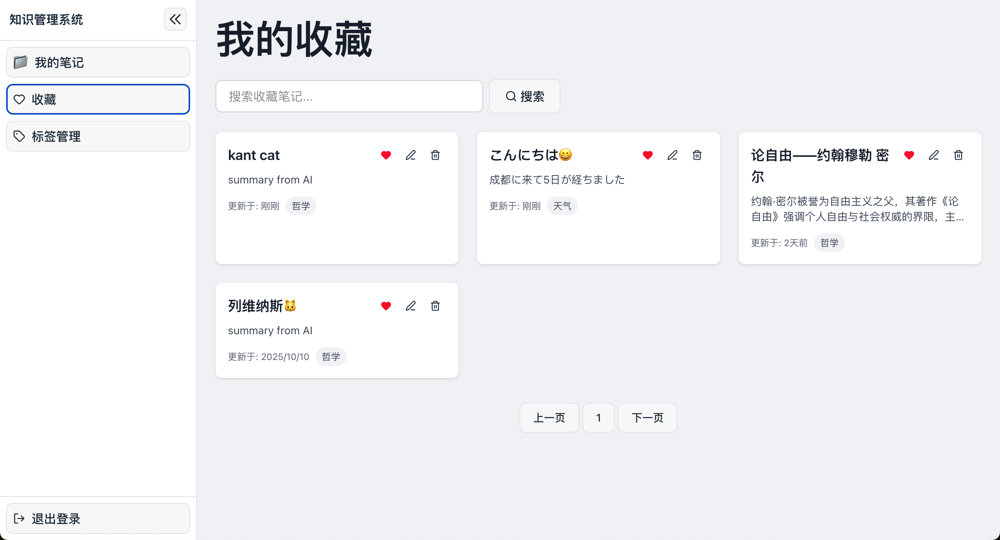

# Knowledge Management System

A knowledge management system based on **FastAPI + PostgreSQL + React**, supporting note taking, tag management, AI-powered summarization & semantic search (integrated with DeepSeek API).




---

## Tech Stack

- FastAPI
- PostgreSQL
- React + Vite
- TailwindCSS
- Docker Compose
- DeepSeek API

---

## Requirements

- Docker & Docker Compose
- Python >= 3.9
- Node.js >= 18

---

## Quick Start

1. Clone the repository

   ```bash
   git clone https://github.com/yourname/knowledge-system.git
   cd knowledge-system
   ```

2. Copy environment variables

   ```bash
   cp .env.example .env
   ```

   Edit `.env` as needed:

   ```env
   POSTGRES_USER=kms_user
   POSTGRES_PASSWORD=kms_pass
   POSTGRES_DB=kms_db
   DEEPSEEK_API_KEY=your_api_key_here
   SECRET_KEY=your_secret_key_here
   ```

3. Start services

   ```bash
   docker-compose up -d
   ```

   After startup:
   - Backend API: [http://localhost:8000](http://localhost:8000)
   - Frontend: [http://localhost:3000](http://localhost:3000)
   - Database: localhost:5432 (see `.env` for credentials)
4. Initialize database

   ```bash
   docker exec -it kms_backend bash
   alembic upgrade head
   ```

---

## Features

- User registration / login / JWT authentication
- Note CRUD
- Tag management
- Full-text & semantic search
- AI-powered summarization & tag generation (DeepSeek API)
- Frontend-backend separation, one-click startup via Docker Compose

---

## Directory Structure

### Backend

```txt
backend/
├── alembic/              # Database migration scripts
│   ├── versions/         # Migration history
│   └── env.py            # Alembic environment config
├── app/
│   ├── api/              # API routes (user, note, tag, etc.)
│   ├── auth/             # Authentication logic
│   ├── crud/             # Database operations
│   ├── models/           # ORM models
│   ├── schemas/          # Pydantic validation models
│   ├── utils/            # Utilities (e.g. AI summary)
│   ├── config.py         # Config file
│   ├── db.py             # Database connection
│   └── main.py           # FastAPI app entry
├── tests/                # Backend tests
├── pyproject.toml        # Backend dependencies & config
├── alembic.ini           # Alembic config
└── README.md             # Backend documentation
```

### Frontend

```txt
frontend/
├── public/                # Static assets (images, SVGs, etc.)
├── src/
│   ├── api/               # API wrappers (Axios instance, API methods)
│   ├── components/        # Common components (cards, dialogs, sidebar, etc.)
│   ├── pages/             # Page modules (login, register, notes, tags, etc.)
│   ├── assets/            # Frontend images, SVGs
│   ├── hooks/             # Custom hooks
│   ├── App.tsx            # Routing config
│   ├── main.tsx           # App entry
│   └── index.css          # Tailwind styles entry
├── package.json           # Frontend dependencies
├── tsconfig.json          # TypeScript config
├── vite.config.ts         # Vite config
└── README.md              # Frontend documentation
```

---

## API Docs

- [Swagger UI](http://localhost:8000/docs)
- [ReDoc](http://localhost:8000/redoc)

---

## Contributing

Contributions are welcome!

1. Fork this repository
2. Create a new branch (e.g. `feature/xxx`)
3. Submit a PR describing your changes
4. Code must pass CI checks

For suggestions or issues, please submit an Issue or join Discussions.

---

## Feedback

- Submit Issue or join Discussions
- `alvingcy1121@gmail.com`

---

## License

MIT © 2025 HyperionXX

---

## Deploy to AWS EC2 (CI/CD)

A simple production path is provided (CI to build/push image, CD to deploy on EC2):

1. Set repository Secrets (Settings → Secrets and variables → Actions):
   - EC2_HOST: EC2 public IP/domain
   - EC2_USER: EC2 login user (e.g., ubuntu / ec2-user)
   - EC2_SSH_KEY: private key (PEM) for the user above
   - GHCR_USERNAME: your GitHub username
   - GHCR_TOKEN: GitHub PAT (read:packages) for EC2 to login GHCR

2. Initialize EC2 (install Docker/Compose, prepare /opt/kms and .env):

   ```bash
   curl -fsSL https://raw.githubusercontent.com/TachikomaX/knowledge-system/master/scripts/ec2-init.sh | bash
   ```

   - The script creates /opt/kms and a template /opt/kms/.env. Fill values like:
     - DATABASE_URL=postgresql+psycopg2://\<user\>:\<password\>@\<rds-endpoint\>:5432/\<db\>
     - DEEPSEEK_API_KEY=your_api_key
     - VITE_API_URL=/api

3. How deployment is triggered:
   - Push to master/main triggers image build & push (.github/workflows/docker.yml) and deployment to EC2 (.github/workflows/deploy-ec2.yml)
   - Or run the Deploy to EC2 workflow manually in Actions

4. Access:
   - App is served on port 80 (Nginx listens 3000 in container, mapped 80:3000 on host)
   - For HTTPS, configure certificates on Nginx/ALB
